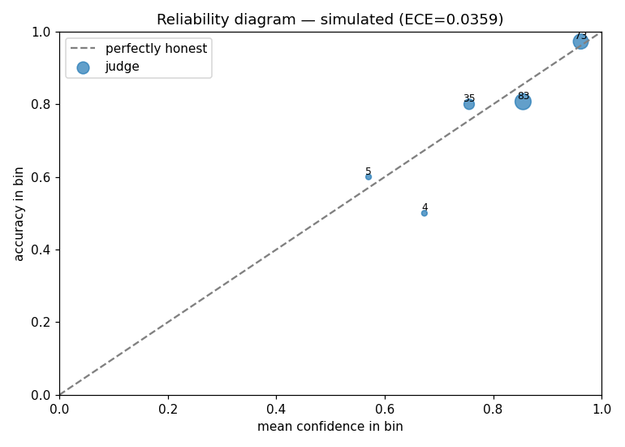
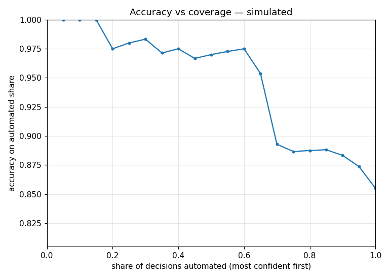

# Sample audit report

> ⚠️ **SIMULATED DEMO — not a real vendor audit.**
> Generated with `--judge simulated`: a seeded simulator that mimics calibrated-judge
> behavior. No TypeSafe API was called. Reproduce it yourself:
> `judge-audit run examples/email-routing/labels.jsonl --judge simulated`

## What an audit answers

| Question | This audit |
|---|---|
| When it says 90% confident, is it right 90% of the time? | ECE = **0.0359** (0 = perfectly honest) |
| What share can I automate at zero observed errors? | **19%** most-confident decisions |
| What does 1,000 decisions really cost? | **$0.08** |
| How bad is the latency tail? | p99 = **0.556s** |

## Reliability diagram

*Each dot is a confidence bin (labeled with n). A perfectly honest judge sits on the dashed diagonal:
average confidence == accuracy in every bin.*

## Accuracy vs coverage

*Sort decisions by confidence, automate the most confident first. This is the business curve:
pick your error budget on the Y axis, read the automation share on the X axis.*

## Full report

# Audit report — simulated

**n=200** · accuracy **85.5%** · ECE **0.0359**
· cost **$0.0160** · p50 **0.407s** · p99 **0.556s**

## Can I automate this?

Zero observed errors through the most confident **19.0%** (38 decisions, confidence ≥ 0.9594).
Retrospective on this dataset — not a production guarantee.

## Accuracy vs coverage

| coverage | accuracy | min confidence | n |
|---|---|---|---|
| 5% | 100.0% | 1.00 | 10 |
| 25% | 98.0% | 0.94 | 50 |
| 45% | 96.7% | 0.88 | 90 |
| 65% | 95.4% | 0.84 | 130 |
| 85% | 88.8% | 0.77 | 170 |

## Calibration (reliability bins)

| confidence bin | avg confidence | accuracy | n |
|---|---|---|---|
| 0.5-0.6 | 0.570 | 60.0% | 5 |
| 0.6-0.7 | 0.673 | 50.0% | 4 |
| 0.7-0.8 | 0.756 | 80.0% | 35 |
| 0.8-0.9 | 0.855 | 80.7% | 83 |
| 0.9-1.0 | 0.961 | 97.3% | 73 |

_A perfectly honest judge sits on the diagonal: avg confidence == accuracy in every bin._

---
*Generated by `judge-audit`. Metrics are deterministic — no LLM in the measurement.*
